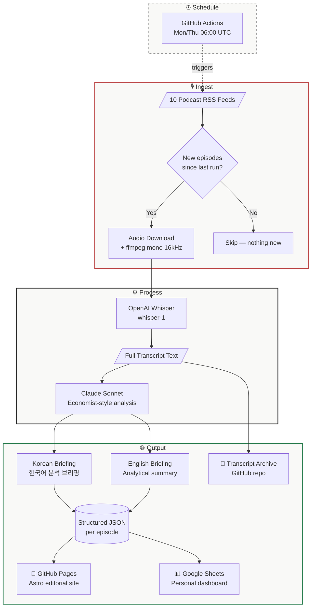

<div align="center">

# Podcast Briefing

**AI-curated bilingual intelligence from the world's best podcasts**

[Live Site](https://kipeum86.github.io/podcast-briefing/) | [한국어 README](README_KR.md)

<br>

*What 10 of the smartest podcast hosts discussed this week — distilled into*
*analytical briefings you can read in 2 minutes, in both Korean and English.*

</div>

---

## What This Is

An automated intelligence pipeline that monitors 10 carefully curated podcast sources spanning macro-economics, AI, geopolitics, venture capital, and public policy. Twice a week, it transcribes new episodes, generates bilingual analytical briefings, and publishes them to a premium editorial web app — fully unattended.

The reading experience is designed to feel like **The Economist meets Stratechery**: authoritative, scannable, and opinionated. Every briefing opens with "So what?" — why a busy reader should care — followed by structured analysis, evidence, and implications. Not AI slop. Structured thinking.

## Sources

| Podcast | Domain | Frequency |
|---------|--------|-----------|
| **Odd Lots** (Bloomberg) | Macro / Markets | 2-3x/week |
| **Dwarkesh Podcast** | AI / Tech Deep Dive | Biweekly |
| **Lex Fridman Podcast** | AI / Science / Philosophy | Biweekly |
| **Fareed Zakaria GPS** (CNN) | Geopolitics / Foreign Affairs | Weekly |
| **Hard Fork** (NYT) | Tech / AI Current Affairs | Weekly |
| **a16z Podcast** | VC / Tech Business | 2-3x/week |
| **Ezra Klein Show** (NYT) | Politics / Policy / Philosophy | 1-2x/week |
| **All-In Podcast** | Tech x Politics x Economics | 1-2x/week |
| **Exponential View** | AI x Energy x Geopolitics | Weekly |
| **Making Sense** (Sam Harris) | Philosophy / AI Ethics | Biweekly |

## How It Works



The pipeline runs **Mon/Thu at 06:00 UTC** via GitHub Actions:

1. **Detect** — parse 10 RSS feeds, identify new episodes since last run
2. **Transcribe** — download audio, preprocess with ffmpeg, transcribe via OpenAI Whisper
3. **Analyze** — Claude generates Economist-style bilingual briefings with claim-based key points, notable quotes, and automatic guest identification
4. **Publish** — JSON to repo, row to Google Sheets, Astro rebuild, GitHub Pages deploy

## Architecture

```
podcast-briefing/
├── pipeline/              # Python: RSS → OpenAI Whisper → Claude → JSON
│   ├── fetch_feeds.py     # RSS parsing + new episode detection
│   ├── download_audio.py  # Audio download + ffmpeg mono 16kHz conversion
│   ├── transcribe.py      # OpenAI Whisper (whisper-1) + Substack fallback
│   ├── summarize.py       # Claude Economist-style analytical briefing prompt
│   ├── generate_output.py # Structured JSON + feed index generation
│   ├── sheets.py          # Google Sheets dashboard integration
│   └── main.py            # Sequential orchestrator with per-episode error isolation
├── web/                   # Astro static site: editorial reading experience
│   └── src/
│       ├── pages/         # index.astro (latest 7 days) + archive.astro (all, by week)
│       ├── components/    # EpisodeCard, QuoteBlock, LangToggle, CategoryFilter
│       ├── layouts/       # BaseLayout with OG meta tags
│       └── styles/        # Editorial design system
├── config/feeds.yaml      # Source configuration (name, RSS URL, homepage, category)
├── data/
│   ├── summaries/         # Per-episode structured JSON (bilingual)
│   ├── transcripts/       # Full transcript text files
│   └── state.json         # Processed episode ID tracking (deduplication)
└── .github/workflows/     # CI/CD: daily-briefing.yml + deploy-web.yml
```

## Design

The editorial design system draws from print journalism traditions:

- **Typography** — Georgia serif for body text, system sans-serif for UI chrome. The font pairing signals editorial authority without importing external fonts.
- **Layout** — 720px reading column, centered. Generous vertical rhythm (56px between episodes, 40px padding). Content breathes.
- **Color** — Near-white background (#fafaf8), dark text (#1a1a1a), a single red accent (#b44) used only for category labels and quote borders. Restraint over decoration.
- **Information hierarchy** — Category → Title → Source/Date → Guest → Summary → Key Points → Quote → Keywords → Action Bar. Each element earns its position.
- **Bilingual toggle** — Both languages are pre-rendered in the HTML. The toggle swaps CSS `display` properties — instant, no network request, no reload. State persisted in `localStorage`.
- **Action bar** — Episode link, transcript copy, Obsidian download — unified at card bottom. The editorial reading flow (summary → points → quote) is never interrupted by utility actions.
- **Sources disclosure** — `<details>` HTML element in the header. Zero JavaScript, keyboard accessible, semantically correct. Not a modal.
- **Mobile** — Action bar stacks vertically, 44px touch targets, horizontally scrollable filter pills. Not "stacked desktop" — intentionally redesigned for thumb reach.

## Features

- **Bilingual briefings** — Korean (formal register, 했습니다 체) and English, toggle instantly
- **Analytical framing** — "So what?" opening, claim-based headings, evidence → implication structure
- **Guest identification** — automatic name + role/affiliation extraction from transcript
- **Transcript access** — copy to clipboard (paste into NotebookLM) or download as Obsidian-compatible .md with frontmatter
- **Google Sheets dashboard** — each episode logged with star rating, read tracking, and notes columns for personal curation
- **Weekly archive** — all episodes grouped by week in a compact, scannable list
- **Date-grouped feed** — main page shows the last 7 days, organized by date headers
- **Category filtering** — pill buttons for Macro, AI/Tech, Geopolitics, VC, Policy
- **Proper noun preservation** — Korean text keeps person names, company names, and technical terms in English for precision

## Setup

1. Clone the repo
2. Set GitHub Secrets: `OPENAI_API_KEY`, `ANTHROPIC_API_KEY`
3. Optional: `GOOGLE_SHEETS_CREDENTIALS` + `GOOGLE_SHEET_ID` for the Sheets dashboard
4. Customize sources in `config/feeds.yaml`
5. Push to trigger the first pipeline run

## Local Development

```bash
# Web app — starts dev server at localhost:4321
cd web && npm install && npm run dev

# Pipeline — requires OPENAI_API_KEY and ANTHROPIC_API_KEY env vars
pip install -r requirements.txt
python pipeline/main.py
```

---

<div align="center">

Built with [Astro](https://astro.build) · [Claude](https://anthropic.com) · [OpenAI STT](https://openai.com)

Designed in the spirit of The Economist

</div>
